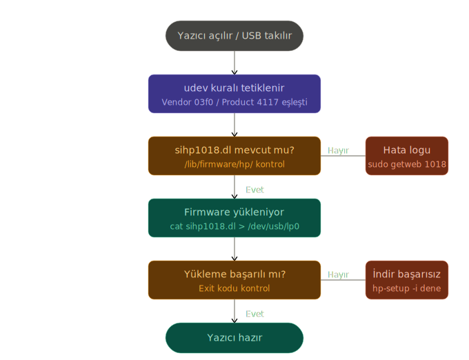

# HP LaserJet 1018 — Linux Mint Kurulum Rehberi

> Eski bir yazıcı, eski bir PC, yeni bir işletim sistemi. Bu rehber o üçlünün bir arada çalışması için.

---

## Neden Bu Repo Var?

Evdeki bilgisayarda güvenlik amacıyla Windows kaldırılıp Linux Mint kuruldu. HP LaserJet 1018 eski bir yazıcı olduğundan standart HPLIP sürücüsüyle tanınmıyor.

İlk denemede AI'ın ürettiği script USB tanımlamasında başarısız oldu. Sorunu manuel olarak inceleyince yazıcının `foo2zjs` sürücüsüne ve USB üzerinden firmware yüklenmesine ihtiyaç duyduğu anlaşıldı. Bu rehber o sürecin sonucunda oluştu.

---

## Test Edilen Ortam

- **İşletim Sistemi:** Linux Mint 21+
- **Yazıcı:** HP LaserJet 1018
- **Bağlantı:** USB

---

## Önemli: Firmware Neden Her Seferinde Yüklenmeli?

HP LaserJet 1018'in kalıcı hafızası yoktur. Yazıcı her kapandığında firmware sıfırlanır. Açıldığında tekrar yüklenmesi gerekir:

```bash
cat /lib/firmware/hp/sihp1018.dl > /dev/usb/lp0
```

Bu işlemi her seferinde manuel yapmak yerine **udev rule** ile otomatikleştirebilirsiniz — yazıcı açıldığında veya USB'ye takıldığında sistem bunu otomatik yapar.

---



---

## Kurulum Seçenekleri

### Seçenek 1 — Otomatik Script (Önerilen)

```bash
chmod +x install_hp1018.sh && sudo ./install_hp1018.sh
```

Script şunları sırasıyla yapar:
- Paket listesini günceller
- `foo2zjs` sürücüsünü kurar
- `getweb 1018` ile `sihp1018.dl` firmware dosyasını `/lib/firmware/hp/` altına indirir
- Yazıcıyı sisteme tanıtır
- udev rule kurarak firmware yüklemesini otomatik hale getirir

### Seçenek 2 — Adım Adım Manuel Kurulum

```bash
sudo apt update
sudo apt install printer-driver-foo2zjs -y
sudo getweb 1018
sudo hp-setup -i
```

---

## Firmware Otomatikleştirme (udev rule)

Yazıcı her açıldığında veya USB'ye takıldığında firmware'in otomatik yüklenmesi için:

```bash
chmod +x setup_udev.sh && sudo ./setup_udev.sh
```

Bu script `/etc/udev/rules.d/` altına bir kural ekler. Artık kimsenin terminale dokunmasına gerek kalmaz.

---

## Önemli Notlar

- **HP 1018, standart HPLIP sürücüsüyle çalışmaz.** `foo2zjs` + `sihp1018.dl` firmware zorunludur.
- **Kurulum sırasında yazıcının USB'ye bağlı olması şart.** Bağlı değilse firmware yüklemesi başarısız olur.
- Script yazıcıyı otomatik algılamazsa `sudo hp-setup -i` ile elle kurulum yapılabilir.
- `lpadmin` grup değişikliği için oturumu kapatıp açmak gerekebilir.

---

## Sorun Giderme

| Belirti | Olası Neden | Çözüm |
|---|---|---|
| Yazıcı listede görünmüyor | USB takılı değil | Kurulum sırasında USB'yi tak |
| Firmware hatası | `sihp1018.dl` yok | `sudo getweb 1018` tekrar çalıştır |
| Her kapanmada sıfırlanıyor | Kalıcı hafıza yok | `setup_udev.sh` ile otomatikleştir |
| İzin hatası | lpadmin grubu yok | `sudo usermod -aG lpadmin $USER` → oturumu kapat/aç |
| Script çalışmıyor | Çalıştırma izni yok | `chmod +x install_hp1018.sh` |

---

## Lisans

MIT — İstediğin gibi kullanabilirsin.
